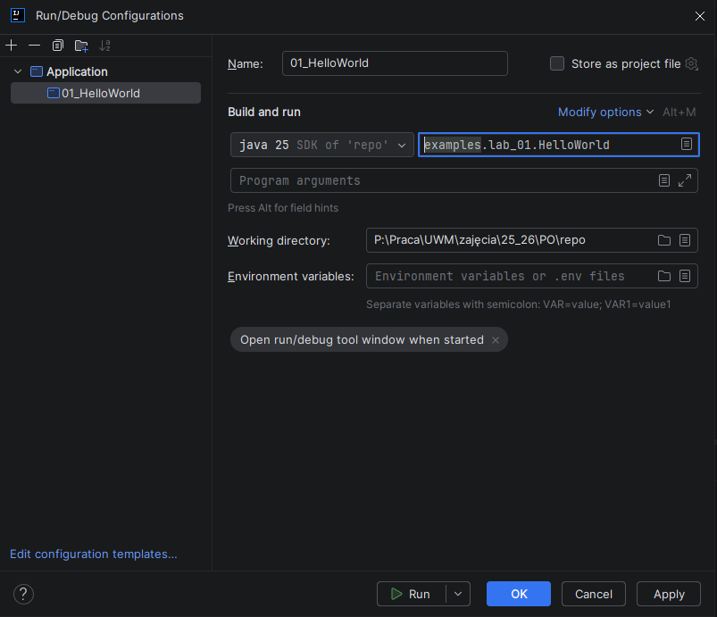

# **Programowanie Obiektowe – Java (2025Z)**

## **Lab 1: Wprowadzenie do Javy – Part I**

---

## 1. Wprowadzenie

Zanim zaczniemy budować złożone aplikacje obiektowe, musimy opanować **podstawy języka Java** — składnię, strukturę programu i sposób jego uruchamiania.
Java to język **w pełni obiektowy**, kompilowany do **bytecode’u** i uruchamiany na maszynie wirtualnej Javy (**JVM**).
Cechuje go przenośność („Write Once, Run Anywhere”), bezpieczeństwo oraz ogromna popularność w systemach backendowych, aplikacjach webowych i mobilnych (Android).

---

## 2. Teoria

### 2.1. Jak działa Java?

1. Kod źródłowy zapisujemy w plikach `.java`.
2. Kompilator (`javac`) tłumaczy go do bytecode’u (`.class`).
3. JVM (Java Virtual Machine) uruchamia kod niezależnie od systemu operacyjnego.

```
KOD .java  →  KOMPILACJA (javac)  →  BYTECODE .class  →  URUCHOMIENIE (java)
```

### 2.2. Minimalny program w Javie

Każdy program musi zawierać **klasę** i **metodę main()** — punkt wejścia programu.

```java
public class HelloWorld {
    public static void main(String[] args) {
        System.out.println("Witaj w świecie Javy!");
    }
}
```

**Wyjaśnienie:**

* `public class HelloWorld` – definicja klasy.
* `public static void main(String[] args)` – metoda uruchamiana jako pierwsza.
* `System.out.println()` – wypisuje tekst na konsolę.

Uruchomienie programu:

```bash
javac HelloWorld.java
java HelloWorld
```

Można też skompilować i od razu uruchomić kod z pliku `.java` używając konfuguracji projektu w IDE IntelliJ. Aby to zrobić kliknij 
u góry IntelliJ'a delikatnie po prawej *Edit Configurations* --> *Add new* --> *Application*, a następnie wybrac plik, który zawiera *main*'a:



Następnie uruchomić plik z przycisku bądź skrótem klawiszowym `CTRL + F5`.

---

## 3. Struktura programu Java

Każdy plik `.java` może zawierać wiele klas, ale **tylko jedna** może być `public` i musi mieć **taką samą nazwę jak plik**.

```java
public class Main {
    public static void main(String[] args) {
        Car car = new Car("BMW", 2020);
        car.startEngine();
    }
}

class Car {
    String brand;
    int year;

    Car(String b, int y) {
        brand = b;
        year = y;
    }

    void startEngine() {
        System.out.println(brand + " uruchamia silnik z roku " + year);
    }
}
```

---

## 4. Typy danych i zmienne

W języku Java wszystkie zmienne muszą mieć określony typ, który informuje kompilator, jaki rodzaj danych przechowuje dana zmienna i jak duży obszar pamięci należy dla niej zarezerwować. Java jest językiem statycznie typowanym, co oznacza, że typ zmiennej jest znany w momencie kompilacji.

W Javie mamy dwa główne rodzaje typów danych:

- Typy proste (prymitywne) — zapisują wartości wprost w pamięci.

- Typy złożone (obiektowe) — przechowują odniesienie (referencję) do obiektu w pamięci.

Na tym etapie skupiamy się na typach prostych (primitive types).

| Typ       | Opis                                            | Rozmiar              | Zakres wartości                 | Przykład                    |
| --------- | ----------------------------------------------- | -------------------- | ------------------------------- | --------------------------- |
| `byte`    | Mały typ liczbowy całkowity                     | 8 bitów              | -128 do 127                     | `byte x = 10;`              |
| `short`   | Średni typ całkowity                            | 16 bitów             | -32,768 do 32,767               | `short y = 3000;`           |
| `int`     | Najczęściej używany typ całkowity               | 32 bity              | -2,147,483,648 do 2,147,483,647 | `int z = 100000;`           |
| `long`    | Duży typ całkowity                              | 64 bity              | ±9,22 × 10¹⁸                    | `long big = 10000000000L;`  |
| `float`   | Liczby zmiennoprzecinkowe (pojedyncza precyzja) | 32 bity              | ok. ±3.4 × 10³⁸                 | `float a = 3.14f;`          |
| `double`  | Liczby zmiennoprzecinkowe (podwójna precyzja)   | 64 bity              | ok. ±1.7 × 10³⁰⁸                | `double b = 3.141592;`      |
| `char`    | Jeden znak (Unicode)                            | 16 bitów             | '\u0000' do '\uffff'            | `char c = 'A';`             |
| `boolean` | Wartość logiczna                                | 1 bit (teoretycznie) | `true` lub `false`              | `boolean isJavaFun = true;` |

Można je zadeklarować w następujący sposób:

```java
public class TypyDanych {
    public static void main(String[] args) {

        // Typy całkowite
        byte wiek = 25; // mały zakres, np. wiek użytkownika
        short temperatura = -15; // np. temperatura w zimie
        int liczbaStudentow = 12345; // najczęściej używany
        long populacjaZiemi = 7_900_000_000L; // duża liczba – 'L' na końcu!

        // Typy zmiennoprzecinkowe
        float pi = 3.14f; // 'f' na końcu, bo domyślnie liczby z kropką to double
        double grawitacja = 9.80665; // dokładniejszy typ

        // Typ znakowy
        char ocena = 'A'; // pojedynczy znak w apostrofach
        char znakUnicode = '\u2764'; // kod Unicode (tu: serduszko ❤️)

        // Typ logiczny
        boolean czyZaliczone = true; // tylko true/false

        // Wyświetlanie wartości
        System.out.println("wiek = " + wiek);
        System.out.println("temperatura = " + temperatura);
        System.out.println("liczbaStudentow = " + liczbaStudentow);
        System.out.println("populacjaZiemi = " + populacjaZiemi);
        System.out.println("pi = " + pi);
        System.out.println("grawitacja = " + grawitacja);
        System.out.println("ocena = " + ocena);
        System.out.println("znakUnicode = " + znakUnicode);
        System.out.println("czyZaliczone = " + czyZaliczone);
    }
}
```

Powyższy kod powinien w efekcie dać nam wynik:
```text
wiek = 25
temperatura = -15
liczbaStudentow = 12345
populacjaZiemi = 7900000000
pi = 3.14
grawitacja = 9.80665
ocena = A
znakUnicode = ❤
czyZaliczone = true
```

### Ciekawostki i pułapki

1. Domyślny typ liczby całkowitej to int.

```java
long liczba = 100; // OK, bo 100 mieści się w zakresie int
long duzaLiczba = 10000000000; // Błąd! Trzeba dopisać 'L'
long duzaLiczba = 10000000000L; // Poprawnie
```

2. Domyślny typ liczby zmiennoprzecinkowej to double.

```java
float x = 3.14;  // Błąd!
float x = 3.14f; // Poprawnie
```

3. Typ char może przechowywać znaki spoza alfabetu łacińskiego.

```java
char litera = 'Ł';
char emoji = '😊'; // Java wspiera Unicode
```

4. boolean to nie liczba.
**Nie można np. zrobić boolean x = 1; – trzeba użyć *true* lub *false*.**

### Typy proste vs. klasy opakowujące (wrapper classes)

Java jest językiem obiektowym, więc dla każdego typu prostego istnieje odpowiadająca mu klasa opakowująca, np.:

| Typ prosty | Klasa opakowująca |
| ---------- | ----------------- |
| `byte`     | `Byte`            |
| `short`    | `Short`           |
| `int`      | `Integer`         |
| `long`     | `Long`            |
| `float`    | `Float`           |
| `double`   | `Double`          |
| `char`     | `Character`       |
| `boolean`  | `Boolean`         |

Pozwalają one używać typów prostych w kolekcjach i wykonywać dodatkowe operacje, np.:

```java
public class KlasyOpakowujace {
    public static void main(String[] args) {
        int liczba = 42;
        Integer liczbaObiektowa = Integer.valueOf(liczba); // autoboxing
        int znowuProsta = liczbaObiektowa; // unboxing

        System.out.println("Wartość liczby: " + liczbaObiektowa);
        System.out.println("Maksymalna wartość int: " + Integer.MAX_VALUE);
        System.out.println("Minimalna wartość int: " + Integer.MIN_VALUE);
    }
}
```

---

## 5. Operacje wejścia/wyjścia na konsolę
Co to jest wejście i wyjście?

- Wejście (input) – dane wprowadzane przez użytkownika, np. z klawiatury.
- Wyjście (output) – dane wyświetlane użytkownikowi, np. na ekranie.

W Javie do tych operacji najczęściej korzystamy z:

- System.out → wyjście na konsolę
- System.in → wejście z klawiatury

Aby wypisać coś na konsoli (terminalu) używamy `System.out.print()`:

```java
System.out.print("Hello ");
System.out.print("World!");
```

Czego wynikiem będzie:

```text
Hello World!
```

Dlaczego wszystko pojawiło się w jednej linii skoro użyliśmy dwóch komend? Otóż powyższa metoda wypisuje tekst bez przechodzenia do nowej linii. Aby automatycznie po zakończeniu wypisywania tekstu na konsolę przejść do nowej linii musimy użyć `System.out.println()`.

Warto zapamiętać, że w środowisku IntelliJ, aby szybciej napisać linię kodu wypisujacą na konsoli tekst z zakończeniem przez nową linię możemy wpisać `sout` i *ENTER*, a środowisko samo zamieni to na `System.out.println()`.

Jednak co w przypadku kiedy chcemy wypisać coś więcej niż tylko stały tekst bądź zmienną, a wręcz tekst i zmienne są na przemian. stnieje metoda, która pozwala na formatowane wypisywanie danych – podobnie jak w języku C.
Używa tzw. specyfikatorów formatu, np. `%d`, `%f` czy `%s`. Jest to `System.out.printf()`.

```java
int wiek = 26;
double waga = 77.6;
String imie = "Adrian";

System.out.printf("Mam na imię %s, mam %d lat i ważę %.1f kg.%n", imie, wiek, waga);

```

A wynikiem tego kodu będzie:

```text
Mam na imię Adrian, mam 26 lat i ważę 77.6 kg.
```

Warto zapamiętać najważniejsze specyfikatory:

| Specyfikator | Znaczenie                 | Przykład  |
| ------------ | ------------------------- | --------- |
| `%d`         | liczba całkowita          | `25`      |
| `%f`         | liczba zmiennoprzecinkowa | `3.14`    |
| `%s`         | tekst (string)            | `"Hello"` |
| `%n`         | nowa linia (zamiast `\n`) | —         |

W Javie dane wprowadzane przez użytkownika odczytuje się najczęściej przy pomocy klasy `Scanner`, dostępnej w pakiecie `java.util`.
Aby to zrobić na początku programu trzeba dodać import tej klasy

```java
import java.util.Scanner;
```

, a następnie w ciele programu stworzyć nowy obiekt klasy `Scanner`

```java
Scanner scanner = new Scanner(System.in);
```

Jednak to nie wystarczy, aby odczytać dane wprowadzane przez użytkownika. Używając obiekt `Scanner` musimy wiedzieć jakiego typu danych się spodziewamy pobierając od użytkownika, a następnie użyć odpowiedniej metody:

| Metoda          | Typ danych                | Przykład   |
| --------------- | ------------------------- | ---------- |
| `next()`        | jedno słowo (do spacji)   | imię       |
| `nextLine()`    | cały wiersz tekstu        | zdanie     |
| `nextInt()`     | liczba całkowita          | wiek       |
| `nextDouble()`  | liczba zmiennoprzecinkowa | waga       |
| `nextBoolean()` | wartość logiczna          | true/false |

```java
import java.util.Scanner; // Import klasy

public class WejscieWyjscie {
    public static void main(String[] args) {

        Scanner scanner = new Scanner(System.in); // Utworzenie obiektu Scanner

        // Pobieranie danych od użytkownika
        System.out.print("Podaj swoje imię: ");
        String imie = scanner.nextLine(); // odczyt całej linii tekstu

        System.out.print("Podaj swój wiek: ");
        int wiek = scanner.nextInt(); // odczyt liczby całkowitej

        System.out.print("Podaj swoją wagę (kg): ");
        double waga = scanner.nextDouble(); // odczyt liczby zmiennoprzecinkowej

        // Wyświetlenie wprowadzonych danych
        System.out.printf("Cześć %s! Masz %d lat i ważysz %.1f kg.%n", imie, wiek, waga);

        scanner.close(); // Zamknięcie skanera (dobre praktyki)
    }
}
```

>**Uwaga: problem z nextLine() po liczbach**
> 
>Jeśli po metodzie nextInt() lub nextDouble() użyjesz nextLine(), możesz napotkać problem – program pominie wiersz.
Dlaczego? Bo Enter po liczbie zostaje w buforze wejścia.
> 
> Zatem jak to poprawnie wykonać?
> ```java
> System.out.print("Podaj wiek: ");
> int wiek = scanner.nextInt();
> scanner.nextLine(); // <-- czyszczenie bufora!
> System.out.print("Podaj imię: ");
> String imie = scanner.nextLine();
> ```

Możemy też wyrównywać tekst podczas wypisywania:

```java
System.out.printf("|%-10s|%10s|%n", "Imię", "Wiek");
System.out.printf("|%-10s|%10d|%n", "Adrian", 26);
```

Efekt:

```text
|Imię      |      Wiek|
|Adrian    |        26|

```

Czy też zaokrąglać jedynie w wyświetlaniu:

```java
double wynik = 3.14159265;
System.out.printf("Wynik: %.2f%n", wynik); // 2 miejsca po przecinku
```

Efekt:

```text
Wynik: 3.14
```

---

## 6. Deklaracja i inicjalizacja zmiennej

**Deklaracja** to poinformowanie programu, że chcemy utworzyć zmienną określonego typu.

```java
int liczba;       // zmienna typu całkowitego
double temperatura; // zmienna typu zmiennoprzecinkowego
char litera;        // zmienna typu znakowego
boolean aktywny;    // zmienna logiczna (true/false)
```

Na tym etapie zmienne istnieją, ale nie mają jeszcze przypisanej wartości.

Inicjalizacja to nadanie zmiennej początkowej wartości.
Można to zrobić od razu przy deklaracji:

```java
int liczba = 10;
double pi = 3.14;
boolean zaliczone = true;
char ocena = 'A';
```

...lub później:

```java
int wynik;
wynik = 100;
```

> Uwaga!!!
> 
> Java nie pozwala używać zmiennych niezainicjalizowanych!
> 
> ```java
> int x;
> System.out.println(x); // Błąd: zmienna x może nie być zainicjalizowana
> ```

W Javie można zadeklarować kilka zmiennych jednocześnie tego samego typu, oddzielając je przecinkami.

```java
int a = 1, b = 2, c = 3;
double x = 2.5, y = 3.14;
boolean p, q = true; // tylko q jest zainicjalizowane!
```
Pamiętajmy, że nazwą zmiennej nie może być już nazwa zarezerwowana jako słowo kluczowe składnika jęzka Java, jak np. `class`.


## 7. Słowo klczuowe `var`

Słowo kluczowe var zostało wprowadzone w Javie 10 (2018 r.).
Pozwala programiście pominąć jawne określenie typu zmiennej, gdy kompilator może ten typ samodzielnie wywnioskować z kontekstu.

Bez `var`:

```java
String imie = "Adrian";
int wiek = 26;
double waga = 57.6;
```

Z `var`:
```java
var imie = "Adrian";
var wiek = 26;
var waga = 57.6;
```

> Ale uwaga — to nie jest dynamiczny typ jak w Pythonie czy JavaScript!
Typ zostaje ustalony raz na zawsze w czasie kompilacji i nie może się później zmienić!!!


## 8. Stałe

**Stała** to zmienna, której wartość nie może zostać zmieniona po przypisaniu.
W Javie oznacza się ją za pomocą słowa kluczowego `final`.

Oznacza to, że:
- można przypisać wartość tylko raz,
- każda próba zmiany zakończy się błędem kompilacji.

```java
public class StalePrzyklad {
    public static void main(String[] args) {
        int liczba = 10;
        liczba = 20; // można zmienić, bo to zwykła zmienna

        final int STALA = 100;
        // STALA = 200; // błąd kompilacji — nie można zmienić wartości stałej

        System.out.println("Zmienna: " + liczba);
        System.out.println("Stała: " + STALA);
    }
}
```

Wynik programu:

```text
Zmienna: 20
Stała: 100
```

Słowo kluczowe `final` oznacza „ostateczny” — coś, czego nie można już zmienić.
W Javie można je stosować do:
- zmiennych → oznacza stałą wartość,
- metod → oznacza brak możliwości nadpisania w klasach pochodnych,
- klas → oznacza brak możliwości dziedziczenia.

> W Javie przyjęło się, że:
> - nazwy stałych piszemy wielkimi literami,
> - słowa oddzielamy podkreśleniem _.

---

## 9. Typ wyliczeniowy `enum`

`enum` (ang. enumeration) to typ wyliczeniowy, który pozwala zdefiniować zbiór stałych nazwanych.

Innymi słowy, enum to sposób tworzenia własnych typów danych, które mogą przyjmować tylko konkretne, z góry zdefiniowane wartości.

Wyobraź sobie, że chcesz zapisać dni tygodnia.
Zamiast pisać:

```java
String dzien = "Poniedziałek";
```

możesz stworzyć typ `DzienTygodnia`, który dopuszcza tylko poprawne wartości:

```java
public enum DzienTygodnia {
    PONIEDZIAŁEK,
    WTOREK,
    ŚRODA,
    CZWARTEK,
    PIĄTEK,
    SOBOTA,
    NIEDZIELA
}

DzienTygodnia dzien = DzienTygodnia.PONIEDZIAŁEK;
```

Dzięki temu:
- nie pomylisz się w literówce („Ponideziałek”),
- nie przypiszesz wartości spoza listy („Środa2”),
- kod staje się bardziej czytelny i logiczny.

Każdy element `enum` to **stała publiczna** i **statyczna** (public static final).
W praktyce działają jak obiekty jednej klasy.

W pełni przykładowy program mógłby wyglądać tak:

```java
public class EnumDemo {
    public static void main(String[] args) {
        DzienTygodnia dzien = DzienTygodnia.WTOREK;

        System.out.println("Dziś jest: " + dzien);

        // Można używać w instrukcji warunkowej:
        if (dzien == DzienTygodnia.SOBOTA || dzien == DzienTygodnia.NIEDZIELA) {
            System.out.println("To weekend!");
        } else {
            System.out.println("To dzień roboczy.");
        }
    }
}

enum DzienTygodnia {
    PONIEDZIAŁEK,
    WTOREK,
    ŚRODA,
    CZWARTEK,
    PIĄTEK,
    SOBOTA,
    NIEDZIELA
}
```

A jego wynikiem byłoby:

```text
Dziś jest: WTOREK
To dzień roboczy.
```

## 10. Instrukcje warunkowe

Instrukcje warunkowe pozwalają programowi podejmować decyzje — czyli wykonywać różne fragmenty kodu w zależności od tego, czy pewien warunek jest prawdziwy (true) czy fałszywy (false).

💡 Java zawsze sprawdza warunki logiczne — np. porównania >, <, ==, !=, >=, <= — które zwracają wartość typu boolean.

Podstawowa instrukcja warunkowa to `if`.

```java
if (warunek) {
    // kod, który wykona się tylko, gdy warunek == true
}
```

Natomiast co jeżeli chcemy, aby coś innego wykonało się, jeżeli warunek nie jest spełniony?
Instrukcja `else` wykonuje się, gdy warunek w `if` nie jest spełniony.

```java
if (warunek) {
    // gdy warunek jest true
} else {
    // gdy warunek jest false
}
```

Czasem chcemy sprawdzić więcej niż jeden warunek.
Do tego służy `else if`.

```java
if (warunek1) {
    // jeśli warunek1 prawdziwy
} else if (warunek2) {
    // jeśli warunek1 fałszywy, ale warunek2 prawdziwy
        
...
        
} else {
    // jeśli żaden z powyższych nie jest prawdziwy
}
```

Instrukcje `if` można umieszczać jedna w drugiej — to tzw. *zagnieżdżone warunki*.

```java
if (wiek >= 18) {
    if (maDowod) {
        System.out.println("Możesz wejść.");
    } else {
        System.out.println("Potrzebujesz dowodu.");
    }
} else {
    System.out.println("Niepełnoletni — brak dostępu.");
}
```

Jeżeli z jakiegoś powodu potrzebujemy krótszej wersji instrukcji warunkowej możemy użyć *trenary oparator*, czyli *operatora trójargumentowego*:

```java
zmienna = (warunek) ? wartośćJeśliTrue : wartośćJeśliFalse;
```

Przykład użycia:

```java
public class TernaryExample {
    public static void main(String[] args) {
        int liczba = -10;
        String wynik = (liczba >= 0) ? "Dodatnia" : "Ujemna";
        System.out.println("Liczba jest: " + wynik);
    }
}
```

Wynik:

```text
Liczba jest: Ujemna
```

Czasami potrzebujemy sprawdzać różność wartości tylko jednej zmiennej. Marnotrastwem czasu i mocy obliczeniowej byłoby używanie konstrukcji `if-else`.
W Javie instrukcja `switch` to alternatywa dla wielu `if-else`, gdy porównujemy jedną zmienną z wieloma wartościami.

```java
switch (zmienna) {
    case wartość1, wartosc 2:
        // kod
        break;
    case wartość3:
        // kod
        break;
    default:
        // kod, gdy żadna wartość nie pasuje
}
```

## 11. Pętle

Pętla to konstrukcja pozwalająca wykonywać blok kodu wielokrotnie, aż do spełnienia określonego warunku.
Korzyści:
- unikamy powtarzania kodu,
- automatyzujemy powtarzalne działania,
- kod staje się bardziej czytelny i łatwiejszy w utrzymaniu.

### 11.1 Pętla `for`
Pętla `for` jest używana, gdy **wiemy, ile razy chcemy coś powtórzyć**.

```java
for (inicjalizacja; warunek; inkrementacja) {
    // kod do wykonania
}
```
, gdzie
- inicjalizacja – ustawienie zmiennej sterującej (np. int i = 0)
- warunek – sprawdzany przed każdym przebiegiem pętli
- inkrementacja/dekrementacja – zmiana wartości zmiennej sterującej

Przykład 1 – wypisanie liczb od 1 do 5:

```java
public class ForExample {
    public static void main(String[] args) {
        for (int i = 1; i <= 5; i++) {
            System.out.println("Liczba: " + i);
        }
    }
}
```

Wynik:

```text
Liczba: 1
Liczba: 2
Liczba: 3
Liczba: 4
Liczba: 5
```

Ale czy zawsze pętla `for` musi miec taki wygląd? Przeanalizujmy poniższy przykład:

```java
int potegaDwojki = 1;

for ( ; potegaDwojki <= 1024; potegaDwojki *= 2){
    System.out.println(potegaDwojki);
}
```

Czy poniższa pętla się wykona? Jeżeli tak to jaki będzie jej wynik?

Otóż tak, poniższa pętla się wykona i wypisze ona kolejne potęgi liczby 2, każdą w nowej linii aż do 1024.

Zatem jak można interpretować skłądnię pętli `for`?

```java
for ( blok kodu do wykonania podczas inicjalizacji pętli ; warunek ; instrukcja do wykonania po każdym obrocie pętli) {
    // kod do wykonania
}
```

### 11.2 Pętla `while`

Pętla `while` jest używana, gdy **nie wiemy dokładnie, ile razy kod zostanie wykonany, a powtarzamy go dopóki warunek jest prawdziwy**.

```java
while (warunek) {
    // kod do wykonania
}
```

Przykład:

```java
int i = 1;
while (i <= 5) {
    System.out.println("Liczba: " + i);
    i++; // inkrementacja zmiennej sterującej
}
```

Wynik:

```text
Liczba: 1
Liczba: 2
Liczba: 3
Liczba: 4
Liczba: 5
```

### 11.3 Pętla `do-while`

Pętla `do-while` działa prawie identycznie jak pętla `while`, ale działa **przynajmniej raz**, bo jej **warunek sprawdzany jest dopiero po wykonaniu obrotu, a nie przed**.

```java
do {
    // kod do wykonania
} while (warunek);
```

### 11.4 Pętla `for-each` (enhanced for loop)

Pętla `for` w języku Java ma swój specjalny podrodzaj do iteracji po tablicach i kolekcjach:

```java
for (typ element : kolekcja) {
    // kod
}
```

Przykład:

```java
int[] liczby = {1, 2, 3, 4, 5};

for (int n : liczby) {
    System.out.println(n);
}
```

Wynik:

```text
1
2
3
4
5
```

### 11.5 Instrukcje sterujące w pętlach

- `break` - Przerywa działanie pętli natychmiast.
```java
for (int i = 1; i <= 10; i++) {
    if (i == 5) break; // przerwij przy i=5
    System.out.println(i);
}
```
Wynik:
```text
1
2
3
4
```
- `continue` - Pomija bieżącą iterację, przechodząc do następnej.
```java
for (int i = 1; i <= 5; i++) {
    if (i == 3) continue; // pomiń i=3
    System.out.println(i);
}
```
Wynik:
```text
1
2
4
5
```

> Trzeba natomiast uważnie używać tych instrukcji sterujących, ponieważ **naruszają one integralność kodu** i potrafią zamienić go na mniej czytelny i stabilny.

---

## Zadania
1. Założyć repozytorium na portalu [github](https://github.com/) i zaprosic prowadzącego (najlepiej przez mail `adrian.albrecht99@gmail.com`) jako Collaborator. Na tym repozytorium osoba studencka umieszczać będzie rozwiązania zadań powiązane z konkretnym labem.
2. Napisz prostą aplikację kalkulatora tekstowego, która przyjmuje dwa liczby od użytkownika jako wejście i wykonuje podstawowe operacje matematyczne (dodawanie, odejmo
   wanie, mnożenie, dzielenie). Wyświetl wyniki na ekranie.
3. Napisz program, w którym zostaną wykonane poniższe operacje za pomocą tzw. złożonych operatorów przypisania (+= ,-= i innych podobnych operatorów):
   - 𝑎 = 𝑎 + 4
   - 𝑏 = 𝑏 − 𝑎
   - 𝑐 = 𝑐 ( 2 − 4 * 𝑎 )
   - 𝑑 = 𝑑 / ( 4 − 𝑎 ^ 2 )
4.  Napisz program, który będzie sprawdzał, czy podany rok jest rokiem przestępnym. Rok
    jest przestępny, jeśli jest podzielny przez 4, ale nie jest podzielny przez 100, chyba że jest
    podzielny przez 400.
5.  Napisz program, który oblicza podatek dochodowy na podstawie podanych dochodów i
    zasad podatkowych. Załóżmy, że podatek wynosi 18% dla dochodu do 85,528 PLN, a
    dla dochodu powyżej tej kwoty podatek wynosi 14,839.02 PLN plus 32% nadwyżki po
    nad 85,528 PLN. Użytkownik powinien wprowadzić swoje dochody, a program powinien
    obliczyć i wyświetlić kwotę podatku.
6. Napisz program sprawdzający czy podane liczby z klawiatury mogą stanowić poprawną
   datę w kalendarzu. Czy jesteś w stanie użyć instrukcji `switch` oraz `enum`? Pamiętaj o roku przestępnym!
> Przykładowe wejście:
> ```text
> Podaj dzień: 29
> Podaj miesiąc: LUTY
> Podaj rok: 2017
> ```
> Przykładowe wyjście:
> ```text
> Błędna data
> ```

7. Napisz program, który używając pętli do-while, wyświetli pierwsze 20 liczb parzystych
   i nieparzystych.
8. Stwórz program, który przyjmie od użytkownika liczbę całkowitą i zwróci tę liczbę w
   odwrotnej kolejności. Na przykład, dla liczby 12345, wynik powinien wynosić 54321.
   Możesz ograniczyć program tylko do liczb dodatnich.
9. Napisz program, który dla dwóch podanych liczb obliczy ich najmniejszą wspólną wielokrotność (NWW). Użytkownik powinien podać dwie liczby jako dane wejściowe.
10.  Napisz program, który wczytuje ze standardowego wejścia dwie liczby całkowite 𝑛 i 𝑚
     (zakładamy, że 𝑛 < 𝑚) i wypisuje na standardowym wyjściu wartość liczby `𝑛 + … + 𝑚`.
11. Napisz program, który pobiera od użytkownika trzy dodatnie liczby całkowite 𝑎,𝑏,𝑐. Na
       standardowym wyjściu wyświetl dodatnie liczby całkowite większe od 𝑏, mniejsze lub
       równe od 𝑎 i podzielne przez 𝑐.
12.  Napisać program, który wczyta z wejścia liczby całkowite aż do napotkania liczby ujemnej, a następnie wyświetla największy oraz najmniejszy element z wczytanych liczb (z
     pominięciem ostatniej, ujemnej liczby). Użyj tylko poznane elementy języka Java (nie używaj kolekcji).